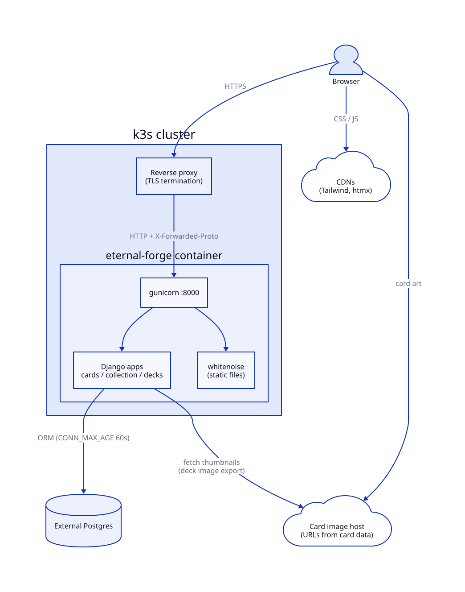
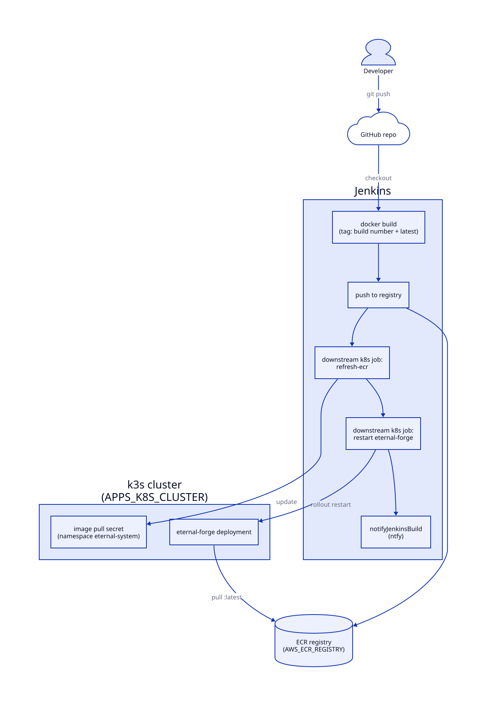

# Eternal Forge

A self-hosted deck builder and collection manager for [Eternal Card Game](https://www.direwolfdigital.com/eternal/). It is a Django app (named `eternal-forge` in the code) that keeps the full card list, your collection and your decks in Postgres, and adds analysis tools for deck building: power and influence odds, opening-hand simulation, goldfishing, a simple deck-vs-deck simulator and matchup tracking.

The repo started as a couple of Python scripts for parsing collection exports. Those scripts are kept in `archive/` for reference; the Django app replaced them.

## Features

- **Cards**: browse and search the card database, imported from an EternalWarcry JSON export (`data/eternal-cards.json`, about 2,260 cards).
- **Collection**: paste or upload the in-game collection export, see what you own, and a completeness report of missing cards by set and rarity.
- **Decks**: create, edit (htmx-driven add/remove), import and export decks in the Eternal text format, including the market. Deck rules (75-150 cards, 4-of limit, one-third power, 5-card market) are enforced from `DECK_RULES` in settings.
- **Versions**: snapshot a deck and restore an earlier version.
- **Collection check**: what you are missing to build a given deck.
- **Power calculator**: hypergeometric odds of hitting power and influence on curve.
- **Draw simulator and hand stats**: interactive opening hands with Eternal's mulligan rules, plus a Monte Carlo run over 1,000+ hands.
- **Goldfish**: plays a deck turn by turn against an opponent who does nothing.
- **Battle simulator**: Monte Carlo deck-vs-deck games under simplified rules (no spell effects or keywords), so treat the win rates as rough.
- **Analysis and compare**: curve, type split, influence requirements, and side-by-side deck comparison.
- **Matchups**: record wins and losses against other decks or archetypes.
- **Deck image**: renders a PNG grid of card thumbnails for sharing.

## Architecture



The app is a single container: gunicorn serving Django, with whitenoise for static files. Postgres runs outside the cluster on a separate server. TLS terminates at a reverse proxy in front of the app, which is why `SECURE_PROXY_SSL_HEADER` and `CSRF_TRUSTED_ORIGINS` are set (without them every POST fails the CSRF origin check). Tailwind and htmx load from public CDNs, and card art is loaded straight from the image URLs in the card data.

`/health/` returns `{"status": "healthy"}` for Kubernetes probes.

### Deployment



`Jenkinsfile` builds the image, pushes it to ECR tagged with the build number and `latest`, then calls a separate Kubernetes operations job twice: once to refresh the registry pull secret in the `eternal-system` namespace, and once to restart the `eternal-forge` deployment so it pulls the new `latest`. The Kubernetes manifests live with that job, not in this repo.

The pipeline expects two Jenkins global environment variables, so no account IDs or host names live here:

| Variable | Used for |
|---|---|
| `AWS_ECR_REGISTRY` | Registry host the image is pushed to |
| `APPS_K8S_CLUSTER` | Cluster name passed to the downstream deploy job |

It also uses an `ecr-credentials` AWS credential and `notifyJenkinsBuild()` from a Jenkins shared library for build notifications. The pipeline runs with `agent none` and only takes an executor for the build stage, so waiting on the downstream job never ties up a node.

## Running locally

You need Python 3.11 and a Postgres database.

```bash
python -m venv .venv && . .venv/bin/activate
pip install -r requirements.txt

export DB_HOST=localhost DB_NAME=eternal_forge DB_USER=eternal_forge DB_PASSWORD=...
python manage.py migrate
python manage.py import_cards                    # loads data/eternal-cards.json
python manage.py import_collection my-collection.txt   # optional
python manage.py createsuperuser                 # optional, for /admin/
python manage.py runserver
```

Or with Docker:

```bash
docker build -t eternal-forge .
docker run -p 8000:8000 \
  -e DB_HOST=... -e DB_PASSWORD=... \
  -e DJANGO_SECRET_KEY=... -e DJANGO_DEBUG=False \
  -e DJANGO_ALLOWED_HOSTS=your.host.name \
  eternal-forge
```

Run `migrate` and `import_cards` once against the database before first use (for example with `docker run ... eternal-forge python manage.py migrate`).

## Configuration

All settings come from environment variables.

| Variable | Default | Notes |
|---|---|---|
| `DB_NAME`, `DB_USER`, `DB_PASSWORD` | `eternal_forge` | Postgres database and credentials |
| `DB_HOST`, `DB_PORT` | `localhost`, `5432` | |
| `DJANGO_SECRET_KEY` | insecure dev key | Always set in production |
| `DJANGO_DEBUG` | `True` | Set to `False` in production |
| `DJANGO_ALLOWED_HOSTS` | `localhost,127.0.0.1` | Comma-separated |
| `DJANGO_CSRF_TRUSTED_ORIGINS` | derived from allowed hosts | Override only if they differ |
| `CARD_DATA_PATH` | `data/eternal-cards.json` | Card JSON used by `import_cards` |

## Import formats

Collection exports and deck lists use the game's text format, one card per line:

```
4 Flash Fire (Set0 #6)
1 Kaleb's Favor *Premium* (Set0 #3)
---------MARKET---------
1 Market Card (Set3 #67)
```

## Layout

```
eternal_forge/   project settings, root URLs, home and health views
cards/           Card and CardSet models, import_cards command, card browser
collection/      collection entries, import_collection command, upload and analysis views
decks/           deck models and views, plus the calculators and simulators
templates/       Django templates (Tailwind + htmx)
static/          favicon and Chart.js
data/            card database JSON
archive/         the original scripts and sample deck and collection files
docs/diagrams/   diagram sources
```

## Status

In use and deployed. The `tests.py` files are still empty stubs, so there is no automated test coverage yet.

## License

GPL-3.0. See [LICENSE](LICENSE).
